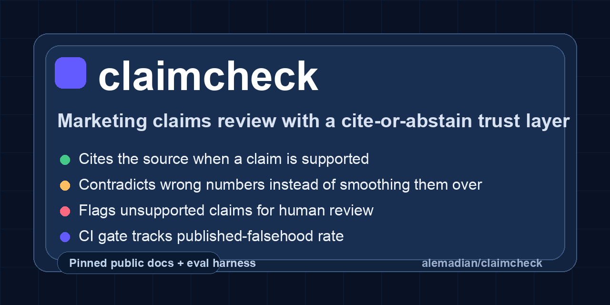
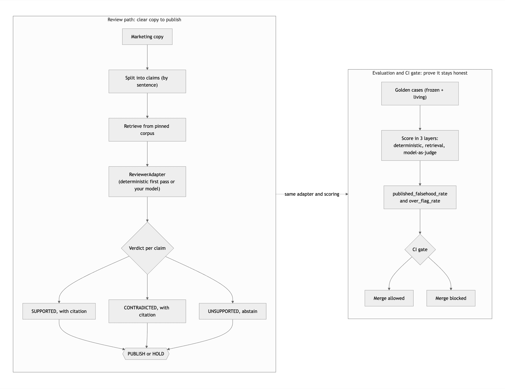

# claimcheck

[](https://github.com/alemadian/claimcheck/actions/workflows/ci.yml)



A proof-of-work repo for AI-assisted marketing review: a claims-review agent
with a cite-or-abstain trust layer, plus the evaluation harness and CI gate that
score it. It checks a piece of marketing copy against a pinned corpus of real,
public source-of-truth documents (here: Stripe pricing and security docs), and
for every claim it returns one of three verdicts with a citation to the exact
passage it relied on:

- **SUPPORTED** the source backs the claim. Cite the passage.
- **CONTRADICTED** the source conflicts with the claim. Cite the passage.
- **UNSUPPORTED** nothing in the source grounds the claim, so the agent abstains
  and flags it for a human instead of vouching for it.

A piece of copy is only cleared to publish when every claim is SUPPORTED.

## At a glance

- **Surface:** marketing claims review on public Stripe pricing and security docs.
- **Trust rule:** cite the source when a claim is supported, contradict it when the source says otherwise, and abstain when nothing grounds it.
- **Eval layer:** golden cases, deterministic trust checks, retrieval metrics, judge calibration, drift tracking, and a CI gate.
- **Headline metric:** published_falsehood_rate, the share of cleared claims the source does not support.
- **Honesty boundary:** the bundled reviewer is a deterministic first pass, and its known misses are tracked in `data/known_gaps/` instead of hidden.

## What it looks like

Point it at a piece of marketing copy and it returns a verdict per claim with the
source it relied on, then an overall PUBLISH or HOLD:

```text
$ claimcheck review --text "Stripe charges 2.9% plus 30 cents per successful card charge. Stripe is available in 195 countries. The rate for a successful card charge is just 1.9%. Stripe guarantees your funds are insured up to one million dollars."

Reviewing 4 claim(s) against 15 source passages (corpus: stripe_docs.jsonl)

[OK ] claim 1: Stripe charges 2.9% plus 30 cents per successful card charge.
        verdict: SUPPORTED - Every figure in the claim matches the cited source.
        source : [d_card_rate] https://stripe.com/en-ca/pricing (captured 2026-06-28)
                 "For online domestic card payments, Stripe charges 2.9% + CA$0.30 per successful card charge."

[OK ] claim 2: Stripe is available in 195 countries.
        verdict: SUPPORTED - Every figure in the claim matches the cited source.
        source : [d_countries] https://stripe.com/en-ca/pricing (captured 2026-06-28)

[!! ] claim 3: The rate for a successful card charge is just 1.9%.
        verdict: CONTRADICTED - The source states a different pct value than the claim.
        source : [d_card_rate] https://stripe.com/en-ca/pricing (captured 2026-06-28)
                 "For online domestic card payments, Stripe charges 2.9% + CA$0.30 per successful card charge."

[ ? ] claim 4: Stripe guarantees your funds are insured up to one million dollars.
        verdict: UNSUPPORTED - No passage in the source cleared the relevance floor; flagged for human review.

VERDICT: HOLD - 2 of 4 claim(s) are not cleared to publish:
  - [contradicted] The rate for a successful card charge is just 1.9%.
  - [unsupported] Stripe guarantees your funds are insured up to one million dollars.
```

## How it works

Two paths share one trust layer. The review path clears a piece of copy to
publish; the evaluation path and CI gate keep the reviewer honest over time. The
same `ReviewerAdapter` and the same scoring run in both, so when you swap the
deterministic first pass for your own model, the gate measures the upgrade on
identical terms.



<sub>Diagram source: [`assets/architecture.mmd`](assets/architecture.mmd)</sub>

## Why this exists

The blocker to letting AI draft or review marketing content is not fluency, it
is trust. A marketer cannot publish what an agent produced unless someone can
answer one question: how do we know it is true, and how often is it wrong? This
repo answers that with a number, not a vibe.

The discipline that makes it trustworthy is cite-or-abstain: the agent never
marks a claim SUPPORTED without a resolvable citation, and when it cannot ground
a claim it says so rather than guessing. The harness then measures the one thing
a marketing org actually cares about, the rate at which the agent would wave a
false claim through to publication, and a CI gate refuses to let that rate rise.

The bundled reviewer and judge run fully offline on the Python standard library,
so the whole thing is runnable out of the box. Swap in your own model behind the
same interfaces without touching the harness.

## Quickstart

```bash
cd content-review-poc
python3 -m venv .venv && source .venv/bin/activate
pip install -e ".[dev]"

# 1) review a real piece of copy against the corpus
claimcheck review --text "Stripe charges 2.9% plus 30 cents per successful card charge. The rate for a successful card charge is just 1.9%. Stripe guarantees your funds are insured up to one million dollars."

# 2) run the eval suite (deterministic + retrieval + judge)
claimcheck run

# 3) save the current scores as the green baseline
claimcheck baseline --out baseline.json

# 4) gate a buggy reviewer against that baseline; it BLOCKS and exits non-zero
claimcheck gate --data data/golden_buggy --baseline baseline.json ; echo $?   # -> 1

# 5) judge-vs-human calibration
claimcheck calibrate

# 6) drift: re-run the frozen split, append to a time series, alarm on drift
claimcheck drift --timeseries history.jsonl

# the test suite
pytest -q
```

The `review` command on the copy above prints, per claim, a verdict, the source
passage it relied on, and that passage's URL and capture date, then an overall
PUBLISH or HOLD. The true price is SUPPORTED, the wrong 1.9% rate is CONTRADICTED
against the cited 2.9% source, and the insurance claim is flagged UNSUPPORTED
rather than waved through.

## How it scores: three layers, cheapest first

The deterministic layer runs on every commit with no judge (`claimcheck run --no-judge`), so per-commit feedback is free and sub-second. The judge layer runs in CI on every push and on a nightly schedule with the bundled offline judge; a real model plugs in behind the same interface. Cheapest and most deterministic first.

1. **Deterministic trust checks** (`claimcheck/deterministic.py`), no model,
   sub-second, on every commit:
   - **grounding isolation**: the prompt the model saw contained the claim and
     the retrieved passages and did not have the answer leaked into it.
   - **citation resolvability**: every citation resolves to a passage that was
     actually retrieved (no invented pointers).
   - **cite-or-abstain integrity**: a SUPPORTED or CONTRADICTED verdict carries a
     citation, and an UNSUPPORTED verdict carries none.
   - **fail closed**: on a claim nothing can ground, the agent abstains, and when
     there was no context at all it did not spend a model call.

2. **Retrieval evaluation** (`claimcheck/retrieval.py`): recall@k, precision@k,
   MRR and nDCG against the gold passages, isolated from the verdict step so a
   regression points at the right layer.

3. **Model-as-judge** (`claimcheck/judges/`), versioned rubric, run in CI and
   on a nightly schedule: faithfulness (is the claim entailed by the cited passage) and
   citation correctness (does the cited passage actually bear on this specific
   claim, beating the hardest decoy passage). The judge model id, temperature,
   seed and prompt version are pinned and recorded in every verdict.

On top of those, the headline metric is **published_falsehood_rate**: of every
claim the reviewer marked SUPPORTED, the fraction the source does not actually
support. A trustworthy reviewer keeps it at zero. It is reported next to
**over_flag_rate**, the productivity tax of flagging good copy, so both failure
directions are visible at once. Verdict accuracy, contradiction recall (did it
catch the wrong prices) and abstention recall round it out.

## Results on the golden set

Latest `claimcheck run` over the pinned golden set (19 cases, bundled offline
judge, single run):

| Metric | Value |
| --- | --- |
| published_falsehood_rate | 0.000 |
| over_flag_rate | 0.000 |
| verdict_accuracy | 1.000 |
| contradiction_recall | 1.000 |
| abstention_recall | 1.000 |
| retrieval_recall_at_k | 1.000 |
| rerank_mrr | 1.000 |
| deterministic_pass_rate | 1.000 |
| faithfulness_rate | 0.556 |
| citation_correctness | 0.600 |

These are in-distribution numbers on the pinned golden set, not a generalization
claim. The headline, `published_falsehood_rate` at 0.000, means nothing the
reviewer cleared was unsupported by its cited source. Verdict accuracy and the
recalls sit at 1.000 because the bundled reviewer is built for exactly these
number-and-unit cases; it misses other cases by design, tracked in
`data/known_gaps/` and in Known limitations below. `faithfulness_rate` and
`citation_correctness` sit near 0.55 to 0.60 on purpose: the bundled judge is a
content-overlap heuristic rather than a model, so the number is real and
unrigged, and a production judge can be swapped in behind the same `JudgeClient`
interface and measured the same way. Reproduce with `claimcheck run`.

## The corpus is real and pinned

`corpus/stripe_docs.jsonl` is real, public Stripe content (Canada pricing and
the security docs), captured 2026-06-28. Every passage records the URL it came
from and the date it was captured, so anyone can re-verify it and a change to
the source of truth is a visible, reviewable diff. Nothing in the corpus is
invented, and `corpus/manifest.json` pins each passage's source URL, capture
date, and the SHA-256 of its stored text, so every passage is traceable to its
source and any change to the corpus is a reviewable diff. The stored passages are
faithful statements of what each page asserts, lightly normalized rather than
always verbatim.

It is deliberately a small curated excerpt, not all of Stripe. The tool checks a
claim against this pinned snapshot, which is the point: you pin your source of
truth and review against it. So the demo's UNSUPPORTED examples are genuine
overclaims or unpublished specifics (a 99.999% uptime guarantee, a made-up
volume rate), not true Stripe facts that merely happen to be outside the excerpt.
When a real fact lives in the snapshot, the tool supports it: the corpus includes
that Stripe returns the dispute fee if you win and that Stripe is available in
195 countries, and the matching claims score SUPPORTED.

## Wiring up your real system

The harness never talks to a reviewer directly, it talks to a `ReviewerAdapter`
(`claimcheck/agent.py`). Write one subclass that calls your service over the same
pinned corpus and returns a `ReviewOutput`, then point the CLI at it:

```bash
claimcheck gate --adapter mypkg.review:make_adapter --baseline baseline.json
```

A real judge is the same idea: subclass `JudgeClient`, call your provider at
temperature 0 with a fixed seed, return the JSON verdict, and pass
`--judge mypkg.review:make_judge`. See `examples/real_reviewer_adapter.py` and
`examples/real_judge_adapter.py`.

## The CI gate

`claimcheck/gating.py` implements a layered merge gate (`gate` exits non-zero on
block):

- **Tier 1 (hard):** every deterministic trust check must be 100% green.
  Any failure blocks the merge, full stop.
- **Tier 2 (delta vs baseline):** published_falsehood_rate and over_flag_rate may
  not rise beyond tolerance, and verdict accuracy, contradiction recall,
  abstention recall, citation correctness, faithfulness and retrieval recall may
  not drop beyond tolerance. No single previously-passing claim may regress, and
  any new claim added in the PR must pass.

The bundled `.github/workflows/ci.yml` gates every push and pull request against
the committed `ci-baseline.json` (and re-runs nightly), and separately proves the
gate has teeth by confirming it blocks a deliberately buggy reviewer. Update the
baseline deliberately with `claimcheck baseline --out ci-baseline.json`, which is
then a reviewable diff. `examples/github-actions.yml` shows the same gate wired
into a PR with the report posted as an artifact.

## The golden dataset

`data/golden/*.jsonl`, one JSON object per line, schema enforced on load (a
malformed case or a citation to a passage outside the corpus blocks the build,
it is never silently skipped). Each case carries the claim, the gold verdict, the
gold supporting passage ids, a claim type for slicing, and an adversarial tag.

Two splits matter: **frozen** never changes and is the drift baseline; **living**
grows by one permanent regression case every time a real production miss
surfaces. `data/golden_buggy/` ships claims that trip the reference reviewer's
documented flaws so the gate has real failures to catch.

## Layout

```
claimcheck/
  schema.py        dataclasses + strict loaders for cases and reviewer output
  corpus.py        the pinned source-of-truth corpus + the retriever
  agent.py         ReviewerAdapter + the reference reviewer + claim splitting
  deterministic.py layer 1 trust checks (no model)
  retrieval.py     layer 2 recall@k / MRR / nDCG
  judges/
    client.py      JudgeClient + offline FakeJudgeClient + JudgeConfig
    rubric_judge.py layer 3 faithfulness + citation correctness (decoy swap)
    calibration.py  judge-vs-human agreement tracker
  metrics.py       aggregation -> headline + per-slice + per-case scoreboard
  gating.py        layered CI regression gate
  drift.py         time-series log + drift alarms
  report.py        console + markdown report
  cli.py           review / run / gate / baseline / drift / calibrate
corpus/            the captured, sourced Stripe docs
data/              golden cases, the buggy set, calibration labels
examples/          real-reviewer + real-judge skeletons, CI workflow
tests/             pytest suite covering every layer
```

## What this is not

- Not a source of truth. It grades a claim against a corpus you pin and control,
  it does not certify that the corpus matches the world. The verdicts are only as
  good as the corpus you curate.
- Not an oracle. A SUPPORTED verdict is evidence-backed decision support, not a
  guarantee, and every HOLD routes to a human.
- Not corpus- or model-agnostic. Swap the corpus or the reviewer and the results
  change, which is why the harness pins both and re-scores every change.
- Not a security boundary. It does not defend against adversarial instructions
  hidden inside the copy under review. Treat untrusted input as untrusted.

## Honest design notes

- The bundled judge is **mechanical** (content-word overlap), so faithfulness on
  the demo lands around 0.5 to 0.6, not a rigged 1.0. That is on purpose: it
  shows the pipeline measures something real, and calibration correctly reports
  when a mechanical judge disagrees with human labels and should be replaced. A
  production judge swaps in via the `JudgeClient` interface.
- The retriever is lexical with a relevance floor. The point of this repo is the
  trust layer and the evaluation, not a novel retriever; an embedding retriever
  drops in behind the same interface.
- The bundled reference reviewer is a deterministic FIRST PASS, not a semantic
  claim checker. It is lexical retrieval plus number and unit comparison, so it
  is strong exactly where the money is (a confidently wrong price, fee, or
  encryption level) and weak on what lexical matching cannot see: negation, a
  false clause smuggled in next to a true one, and relationship or causal errors.
  Those are the cases you put a model behind the same `ReviewerAdapter` for. The
  point of the repo is that the trust layer and the harness do not change when
  you do: the deterministic checks, the published-falsehood metric, and the gate
  score the upgraded reviewer the same way, so you can prove the model did better.
- Each golden case is one atomic claim, and the live `review` command splits copy
  on sentences and semicolons. A compound sentence that bundles a true clause and
  a false one is reviewed as a unit today; decomposing copy into atomic claims
  before review is the obvious next step, and a model does it well.

## Known limitations (tracked, not hidden)

The bundled reviewer has failure modes I can name, and they are written down as
runnable cases in `data/known_gaps/` rather than quietly left out:

- **Negation.** "Stripe does not encrypt card numbers at rest" has high lexical
  overlap with the source and no conflicting number, so the first-pass reviewer
  wrongly marks it supported.
- **A historical stat read as a guarantee.** The source says 99.999% average
  historical uptime; "Stripe guarantees 99.999% uptime" reuses the number, so the
  first-pass reviewer wrongly supports it. Separating a past stat from a forward
  guarantee needs a model.
- **A substituted subject.** "All bank account numbers are encrypted at rest with
  AES-256" reuses the encryption wording and the number from the card-number
  passage, so the first-pass reviewer wrongly supports it. Telling a swapped
  subject apart from a valid synonym or plural paraphrase ("every card number"
  vs "all card numbers") needs a model, not bag-of-words overlap.

Run `claimcheck run --data data/known_gaps` to watch it miss them. That is the
boundary: a model wired in behind the same `ReviewerAdapter` closes these, and
the deterministic checks, the published-falsehood metric, and the gate score the
upgrade on exactly these cases, unchanged. Grounding isolation is also a
structural check today; a stricter prompt manifest (corpus hash, prompt-builder
version) is the next hardening step.
